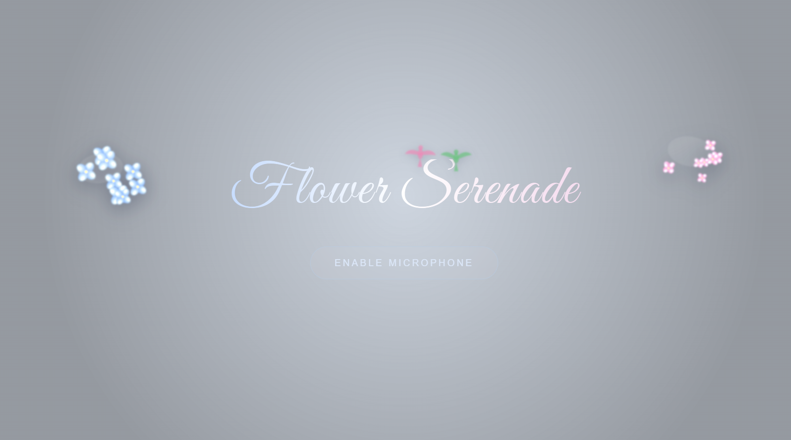

<!-- びっくりマーク！画像 hazu -->
<!-- びっくりマーク！画像1 -->

<!-- びっくりマーク！スクショ -->

最初の画面でマイク許可をタップしてみてください。あとは、画面に向かって、好きなように言いたい言葉を発してください。
音声の保存はありません。データは残りませんので自由に話してください。
無機質な模様から次第にお花に変化していきます。
子育て中の方々、家の仕事がある方は手を離せないので、一瞬でもストレス解消していただけると幸いです。

体験
→https://flower-serenade.vercel.app

🌸Please tap "Allow Microphone" on the first screen. After that, feel free to say whatever words you like. Your voice is not recorded, and no data is saved, so please speak freely. The inorganic patterns will gradually transform into flowers. I hope this brings a moment of stress relief to busy parents and anyone tied up with housework who can't take their hands away.
​Try it here → https://flower-serenade.vercel.app
